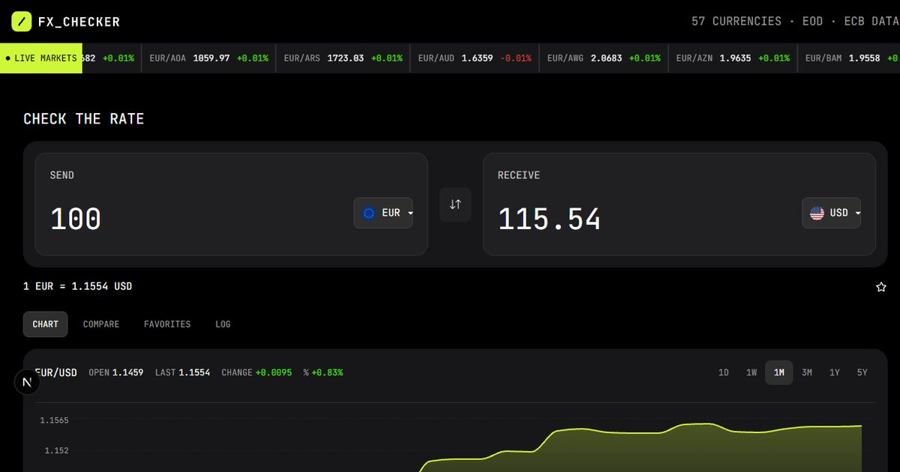

# Frontend Mentor — FX Checker

A dark-themed FX (foreign exchange) currency converter built with the Next.js
App Router. It streams live ECB/EOD rates into a scrolling marquee, converts
between 57 currencies with a two-way field layout, and backs the converter with
a rate history chart, pair comparison, favorites, and a conversion log.

## Overview

### Screenshot



### Links

- Live Site URL: [https://fx-currency-converter-nine.vercel.app](https://fx-currency-converter-nine.vercel.app)
- Repository URL: [https://github.com/Abo3baziz/fx-currency-converter](https://github.com/Abo3baziz/fx-currency-converter)

## Features

- **Live ticker** — a marquee of ECB/EOD rates (today vs. yesterday) with
  change badges, updated from the Frankfurter API.
- **Two-way converter** — type in either field; the other derives from the live
  pair rate. Swap the pair with one click.
- **Searchable currency picker** — 57 currencies with flags, a search box, and
  a "popular" group so common pairs are easy to reach.
- **Rate history chart** — an interactive area chart with 1D / 1W / 1M / 3M / 1Y
  / 5Y ranges plus high, low, and change stats.
- **Compare & favorites** — pin pairs to a favorites list and compare any pair
  side by side; both persist across reloads.
- **Conversion log** — manual logging of conversions with relative timestamps.
- **Resilient data layer** — every API failure surfaces in the UI with a retry
  button; queries are cached by TanStack Query.
- **Accessible** — full keyboard navigation (roving tabs, arrow-key listbox),
  ARIA live announcements, visible focus rings, and reduced-motion support.

## Built with

- [Next.js](https://nextjs.org) 16 (App Router) & React 19
- [TypeScript](https://www.typescriptlang.org) (strict mode)
- [Tailwind CSS](https://tailwindcss.com) v4 with custom theme tokens
- [TanStack Query](https://tanstack.com/query) for data fetching & caching
- [Zustand](https://zustand.docs.pmnd.rs) for state persistence
- [Recharts](https://recharts.org) for the rate history chart
- [react-fast-marquee](https://github.com/justin-chu/react-fast-marquee)
- [Frankfurter API](https://www.frankfurter.dev) for ECB daily rates

## How to run locally

```bash
npm install
npm run dev
```

Open [http://localhost:3000](http://localhost:3000) with your browser. To check
the production build:

```bash
npm run lint
npm run build
npm run start
```

## Credits

- **Case study**: see [docs/case-study.md](docs/case-study.md) for a full
  engineering write-up (architecture, ADRs, data flow).
- **Data**: ECB daily reference rates via the [Frankfurter API](https://www.frankfurter.dev).
- **Icons**: Next.js starter icons, plus custom-built SVG assets in
  `public/images/`.
- **Flags**: [flagcdn.com](https://flagcdn.com/) flag images (downscaled WebP).
- **Font**: [JetBrains Mono](https://www.jetbrains.com/lp/mono/).

## Author

Ahmed Aziz

- Frontend Mentor: [Abo3baziz](https://www.frontendmentor.io/profile/Abo3baziz)
- GitHub: [Abo3baziz](https://github.com/Abo3baziz)

## Acknowledgments

A challenge from the Frontend Mentor [hackathon](https://www.frontendmentor.io)
starter template — converting between live currencies with ECB end-of-day data
and a clean, minimal dark UI.